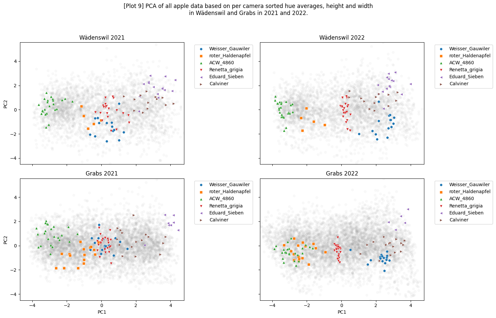

# mpb-apple-analysis
Repository containing the code used in the analysis of fruits diversity from various apple accessions.
The report for this lab rotation is saved as `mpb_rotation_report.pdf`

## Requirements and expected data

The input data is NOT included here. The scripts here assume that the analysis starts from the extraction of the zip file with subdirectories of years, within them subdirectories of locations, where summary files can be found.

Libraries used:
* `os`
* `numpy`
* `math`
* `pandas`
* `matplotlib`
* `seaborn`
* `cv2`
* `sklearn`
* `skimage`
* `statsmodels`

Data used:

Summaries of apple colors and shapes of apples from Wädenswil and Grabs in 2021 and 2022. 
Image data would be too massive and tedious to analyze locally (and virtually) and would only help with data concerning edges/shapes. However, a script dealing with edge data, clustering apples by similarities of edge distances to center, is also provided. Instead, the shape classes obtained in prior analysis are used as additional traits/variables.

## Information on contents of the repository

* `utils.py` - module containing functions used in data pre-processing and visualization
* `01_main_pca.py` - main code for the first part
* `02_shape_size.py` - main code for the second part, descriptive shape data and obtaining shape-related variables for selected cultivars
* `03_consistency_pca_color_shape.py` - script for third part
* folder `1_results` - plots showing results and tabular data output from the first approach
* folder `2_results` - plots showing results and tabular data output from the second approach
* `badges_hw_ratio_assignments.csv` - CSV file containing badges and their top shape assignment based on clustering, as well as the values of the top K PCs (representing >=80% of the variance) for reconstructing the PCA plots for clustering.
* `cultivar_plot_data_appleLevel.csv` - CSV file for locating the plots of cultivars for 2021, 2022 wae/gra 2x2 plots obtained in the second part.
* `intra_cultivar_distances.csv` - CSV file containing intra-cultivar distances for each year and location, measured in pixels (mappable to cm or mm by comparing with summary dataset), obtained in the seocond part.

## Analysis parts

### Part 1 - overview of apple color diversity

Script: `01_main_pca.py`

#### Summary

Rough overview of the consistency of average badge apple fruit color appearances, using a "most average" apple as a singular representative of a badge in a given year or location. The analysis involves extracting the best average color hue representative for badges with at least N apples imaged, choosing a real apple whose color hue frequency distributions are least different from the calculated hue frequency distribution averages in the given badge+location+year.
Plots obtained in this part can be viewed on `1_results`.

#### Steps
1. First, the average prevalence at each "value" of HUE (H) and SATURATION (S) is measured. If the number of apple samples is at least N (N = 5 default),

  2. The H and S values of each individual apple are compared with the means for each H/S values of the whole badge's batch.
  3. The individual appleNR with the lowest Manhattan distance to the batch average for H and S values is chosen as the "color representative apple". In further analysis from here onwards, only the H values are considered.
  4. The badge and it's representative appleNR are returned as a dictionary.   
5. Using the badge annotation file, only common badges present in both years and locations are kept.
6. The average apple representative hue distributions are extracted and the average apple becomes the representative of the badge in the given year and location.
7. The apple is assigned an "expected" color class based on the most prevalent hue (red, red-yellow, yellow, yellow-green, green)
8. PCA is carried out on the dataset of badge-representing apples to obtain an average color distribution for each location and year. 2D (2nd, 3rd PC) PCA plots are obtained.

### Part 2 - shape/size estimation

Script: `02_shape_size.py` 

#### Summary

De novo height vs width (pixel) measurements of apples and obtains the variance of each cultivar in terms of these two dimensions, for both years and locations. This scrips creates a very large amount of descriptive plots, which can be viewed with more information in the folder `2_results` Tabular data is generated that would serve as a recommendation for badges to use for generative model learning, based on height and width variance over the years and locations.

#### Steps

1. The shortlisted common badges (at least 5 apples per badge in all years+locations) from the previous analysis step are merged with measured trait information (height, width) at individual apple level.
2. Mean height-width ratio (HWR) of each apple is obtained to be used as proxy for the apple shape, as (based on the supplementary material 2 of the FruitPhenoBox paper), there rarely is a cultivar that has the same shape class out of the 13 used in the original analysis.
3. Height vs width plots of all apples are made, iteratively highlighting (default - 6) cultivars in each year and location simultaneously. A reference line at HWR=1 is drawn on each individual plot.
4. Intra-cultivar (cluster) distances are measured and saved.
5. A plot of cultivar-average HWR vs stdev(as fraction of HWR) is done with iteratively highlighting (default - 6) cultivars in each year and location simultaneously. A reference / recommendation line at stdev = 0.05 is drawn on each individual plot to represente an upper bound of 5% error in HWR, which implies that the apples in the cultivar have very variable HWRs and might not be reliably predicted.
6. Plots of step 3 and 5 are saved as folders (here - zip files in the folder 2_results) containing multiple plots for 6 cultivars each, and a CSV table with cultivar assignments to plot.

### Part 3 - intra- and inter-badge (genotype x environment) variation estimation

Script: `03_consistency_pca_color_shape.py`

#### Summary

More detailed look at the variance of apple fruit color appearances and shapes using the shortlist of common badges obtained in the previous analysis approach. Tabular data is generated that would serve as a recommendation for badges to use for generative model learning based on the consistency of apple coloration, as well as shape-approximating data from the previous step.

#### Steps

1. The shortlisted common badges (at least 5 apples per badge in all years+locations) from the previous analysis step are used.
2. Instead of using the mean of hue distributions of 5 cameras for an apple, all individual cameras' hue distributions are transformed into one vector of 12 (relevant third of unique hues) * 5 (number of cameras) dimensions, with each camera's groups first sorted by ascending mean hue. A set of vectors is obtained for each apple. Additionally, another set of vectors is obtained, where instead of 12 hues, each camera's mean hues are sorted in ascending order (therefore, hue value from red towards green). The heights and widths, as well as HWRs from the previous part are appended as additional variables for each set of vectors.
3. PCA plots of apples of the shortlisted badges are obtained for each year and location, yielding:
  * multiple plots with (default = 6)
4. Using the first K PCs (representing ~80% or more of the variance - default = 22 for set 1 and 3 for set 2), the intra-badge distances are calculated. 2D PCA plots of top 3 PCs against each other are obtained, each saved PC comparison saved in its own folder.

